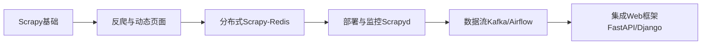

---

## **Scrapy 系统学习计划**（含主流框架集成）

### **第一阶段：Scrapy 核心基础**（1周）
**目标**：掌握 Scrapy 核心组件和工作原理  
**学习内容**：
1. **Scrapy 架构**  
   - Engine、Scheduler、Downloader、Spiders、Item Pipeline 协作流程
   - `scrapy crawl` 命令的完整生命周期
2. **基础爬虫开发**  
   - Spider 类（`scrapy.Spider`, `CrawlSpider`）  
   - 选择器（XPath/CSS）与 `response` 对象操作  
   - Item 定义与数据结构化  
3. **数据存储**  
   - 通过 Pipeline 存储到 JSON/CSV/MySQL/MongoDB  
   - 去重（`scrapy.dupefilters`）  

**实践项目**：  
- 爬取豆瓣电影TOP250（标题、评分、链接）并存入 MySQL  
- 使用 `CrawlSpider` 规则爬取新闻网站分页内容  

---

### **第二阶段：Scrapy 高级技巧**（1周）
**目标**：解决反爬问题与性能优化  
**学习内容**：
1. **反爬对抗**  
   - UserAgent/IP 轮换（`scrapy-fake-useragent` + 代理池）  
   - 动态 Cookie 处理（`scrapy.downloadermiddlewares.cookies`）  
   - 验证码识别（集成第三方服务如 `Tesseract` 或打码平台）  
2. **动态页面抓取**  
   - Splash 渲染（Docker 部署 + `scrapy-splash`）  
   - Selenium 集成（需配合 `scrapy-proxies` 避免阻塞）  
3. **性能优化**  
   - 并发控制（`CONCURRENT_REQUESTS`）  
   - 下载延迟与自动限速（`AutoThrottle`）  

**实践项目**：  
- 爬取京东商品评论（JavaScript 动态加载）  
- 高并发爬取天气数据（使用代理池避免封禁）  

---

### **第三阶段：Scrapy 与其他框架集成**（2周）
#### **1. 分布式爬虫（Scrapy-Redis）**
**用途**：多机协同爬取，突破单机性能瓶颈  
**关键技术**：  
- Redis 作为请求队列和去重存储  
- 共享指纹集合（`dupefilter`）  
```python
# settings.py
SCHEDULER = "scrapy_redis.scheduler.Scheduler"
DUPEFILTER_CLASS = "scrapy_redis.dupefilter.RFPDupeFilter"
REDIS_URL = 'redis://localhost:6379'
```

#### **2. 自动化部署（Scrapyd + Gerapy）**
**用途**：远程部署和监控爬虫  
- **Scrapyd**：通过 HTTP API 管理爬虫  
- **Gerapy**：可视化监控工具  
```bash
# 部署爬虫到 Scrapyd
scrapyd-deploy target_name -p project_name
```

#### **3. 数据流集成（Kafka + Apache Airflow）**
**用途**：构建爬虫数据流水线  
- **Kafka**：实时接收 Scrapy 数据（通过 `kafka-python`）  
- **Airflow**：定时调度爬虫任务  

#### **4. REST API 集成（FastAPI/Django）**
**用途**：为爬虫提供控制接口  
```python
# FastAPI 示例：启动爬虫
from fastapi import FastAPI
import subprocess

app = FastAPI()

@app.post("/run_spider/")
def run_spider(spider_name: str):
    subprocess.run(["scrapy", "crawl", spider_name])
    return {"status": "success"}
```

---

### **第四阶段：实战项目整合**
**项目示例**：  
1. **电商价格监控系统**  
   - Scrapy 爬取多平台商品价格  
   - 数据存入 PostgreSQL + 通过 Django 展示  
   - 价格异常时触发邮件报警（Celery 异步任务）  

2. **新闻聚合平台**  
   - 分布式爬取 10+ 新闻站点（Scrapy-Redis）  
   - 使用 Splash 处理动态内容  
   - 通过 Airflow 每天定时更新  

---

### **推荐学习资源**
1. **官方文档**  
   - [Scrapy 官方文档](https://docs.scrapy.org/)  
   - [Scrapy-Redis GitHub](https://github.com/rmax/scrapy-redis)  
2. **书籍**  
   - 《Python网络爬虫权威指南》（Scrapy 章节）  
   - 《Scrapy 实战》（中文版）  
3. **工具链**  
   - **代理池**：https://github.com/jhao104/proxy_pool  
   - **Gerapy**：https://github.com/Gerapy/Gerapy  

---

### **学习路线图**


按此计划，您可以在 **1个月** 内系统掌握 Scrapy 及其生态工具，并能够根据实际需求灵活组合技术栈。