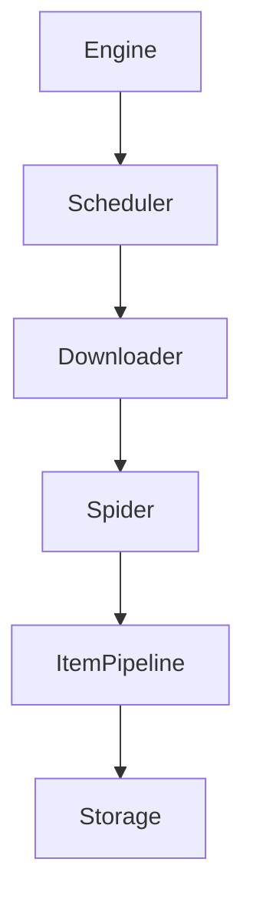
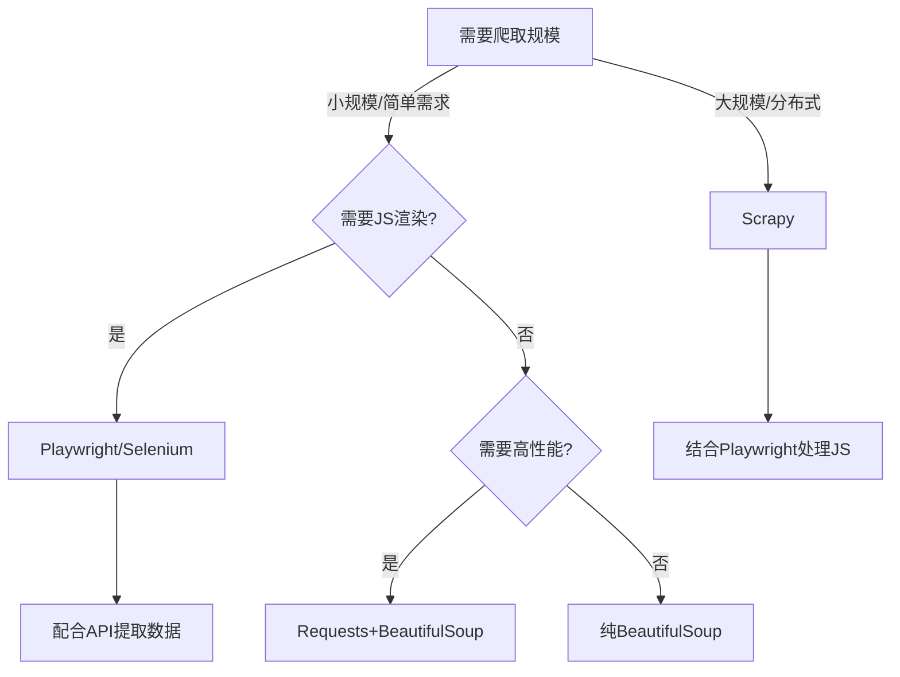
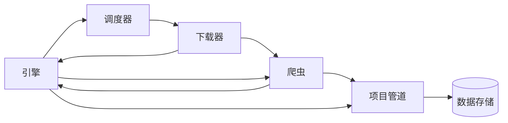
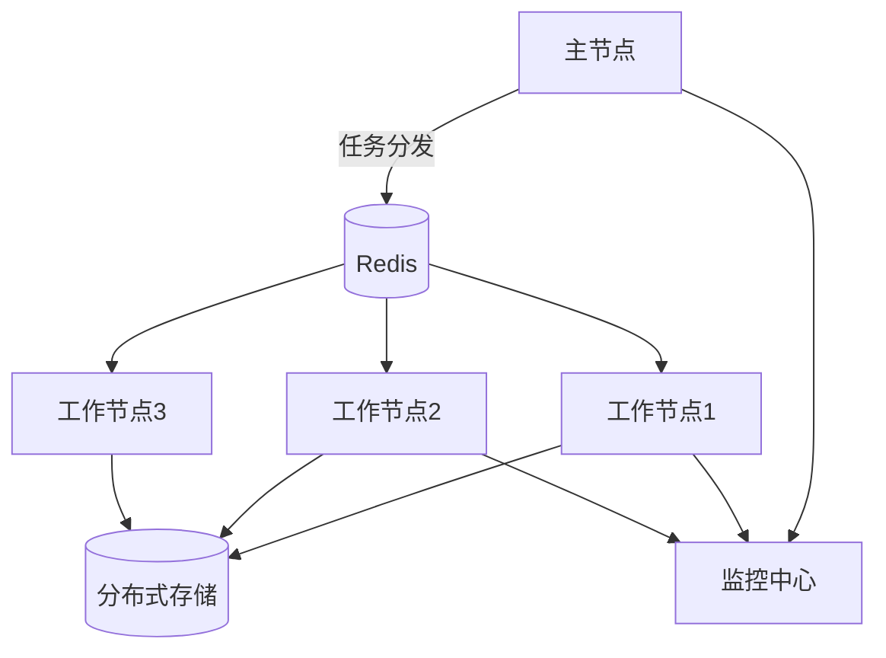
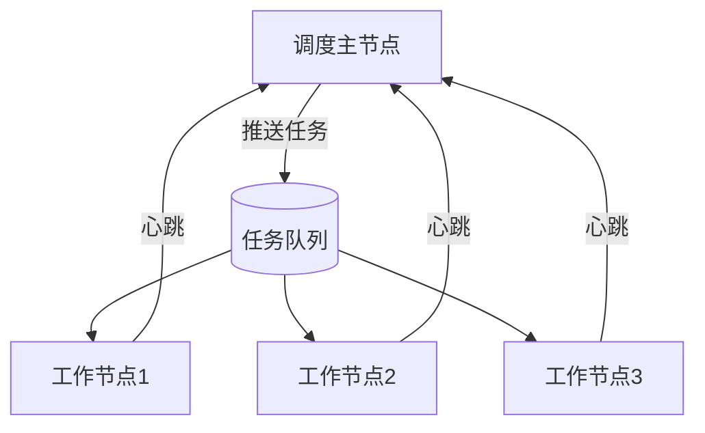
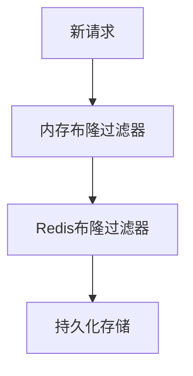
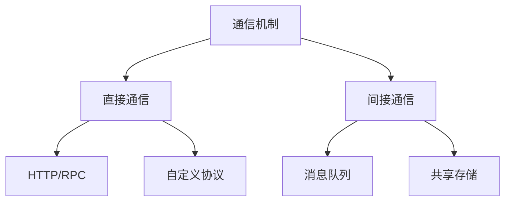

# 1. **工具与框架**

## 主流爬虫框架技术对比与选型指南

以下是Python生态中主要爬虫框架/库的深度对比分析，帮助开发者根据项目需求选择合适的工具：

### 一、核心框架对比矩阵

| 特性                | Scrapy            | BeautifulSoup     | Requests         | Selenium         | Playwright       |
|---------------------|-------------------|-------------------|------------------|------------------|------------------|
| **类型**            | 全功能框架         | HTML解析库        | HTTP客户端库     | 浏览器自动化      | 浏览器自动化      |
| **学习曲线**        | 中高              | 低                | 低               | 中               | 中               |
| **性能**            | 极高(异步)        | 高(依赖解析器)    | 高               | 低               | 中高             |
| **JS渲染支持**      | 需配合中间件       | 不支持            | 不支持           | 完整支持          | 完整支持          |
| **分布式支持**      | 原生支持           | 需自行实现        | 需自行实现       | 困难             | 困难             |
| **反爬对抗能力**    | 强                | 无                | 基础             | 极强             | 极强             |
| **适用场景**        | 大规模专业爬虫     | 小规模快速解析    | API调用/简单爬取 | 复杂交互网站      | 现代Web应用       |

### 二、技术深度解析

#### 1. Scrapy - 工业级爬虫框架

**架构设计**：


**核心优势**：
- 内置异步处理引擎(Twisted)
- 中间件系统灵活扩展
- 完善的调试工具(scrapy shell)
- 原生支持：
  ```bash
  scrapy genspider example example.com
  scrapy crawl example -O output.json
  ```

**典型应用**：
```python
import scrapy

class NewsSpider(scrapy.Spider):
    name = 'news'
    start_urls = ['https://news.example.com']
    
    def parse(self, response):
        for article in response.css('div.article'):
            yield {
                'title': article.css('h2::text').get(),
                'url': article.css('a::attr(href)').get()
            }
        
        next_page = response.css('a.next-page::attr(href)').get()
        if next_page:
            yield response.follow(next_page, self.parse)
```

#### 2. BeautifulSoup - HTML解析利器

**解析器性能对比**：
| 解析器       | 速度   | 依赖          | 容错性 |
|--------------|--------|--------------|--------|
| html.parser  | 中      | 内置         | 中      |
| lxml         | 快      | 需安装       | 高      |
| html5lib     | 慢      | 需安装       | 极高    |

**最佳实践**：
```python
from bs4 import BeautifulSoup
import requests

html = requests.get('https://example.com').text
soup = BeautifulSoup(html, 'lxml')  # 推荐lxml解析器

## CSS选择器与find方法结合
for item in soup.select('div.items'):
    title = item.find('h3', class_='title').get_text(strip=True)
    price = item.select_one('.price::text').get()
```

#### 3. Requests - HTTP请求之王

**高级技巧**：
```python
import requests
from requests.adapters import HTTPAdapter
from urllib3.util.retry import Retry

## 会话配置
session = requests.Session()

## 重试策略
retries = Retry(
    total=3,
    backoff_factor=1,
    status_forcelist=[500, 502, 503, 504]
)

## 适配器配置
session.mount('http://', HTTPAdapter(max_retries=retries))
session.mount('https://', HTTPAdapter(max_retries=retries))

## 使用示例
response = session.get(
    'https://api.example.com/data',
    headers={'User-Agent': 'Mozilla/5.0'},
    timeout=(3.05, 27)
)
```

#### 4. Selenium vs Playwright

**功能对比**：

| 特性                | Selenium          | Playwright        |
|---------------------|-------------------|-------------------|
| 执行速度            | 慢                | 快(节省40%时间)   |
| 浏览器支持          | 广                | Chromium/Firefox/WebKit |
| 自动等待机制        | 需显式等待        | 智能自动等待      |
| 网络拦截            | 有限支持          | 强大支持          |
| 移动端模拟          | 需扩展            | 原生支持          |

**Playwright优势示例**：
```python
from playwright.sync_api import sync_playwright

with sync_playwright() as p:
    browser = p.chromium.launch(headless=False)
    context = browser.new_context(
        user_agent='Mozilla/5.0...',
        viewport={'width': 1920, 'height': 1080}
    )
    
    # 网络拦截
    def intercept(route):
        if 'ads' in route.request.url:
            route.abort()
        else:
            route.continue_()
    
    context.route('**/*', intercept)
    
    page = context.new_page()
    page.goto('https://example.com')
    page.click('text=Login')
    
    # 处理弹窗
    page.on('dialog', lambda dialog: dialog.accept())
    
    content = page.content()
    browser.close()
```

### 三、组合使用方案

#### 1. Scrapy + Playwright
```python
## middlewares.py
from scrapy import signals
from playwright.sync_api import sync_playwright

class PlaywrightMiddleware:
    def __init__(self):
        self.playwright = sync_playwright().start()
        self.browser = self.playwright.chromium.launch()

    def process_request(self, request, spider):
        if request.meta.get('playwright'):
            page = self.browser.new_page()
            page.goto(request.url)
            html = page.content()
            page.close()
            return HtmlResponse(url=request.url, body=html.encode(), encoding='utf-8')
```

#### 2. Requests + BeautifulSoup + 多线程
```python
from concurrent.futures import ThreadPoolExecutor
import requests
from bs4 import BeautifulSoup

def fetch_and_parse(url):
    try:
        response = requests.get(url, timeout=10)
        soup = BeautifulSoup(response.text, 'lxml')
        return {
            'url': url,
            'title': soup.title.string
        }
    except Exception as e:
        return {'url': url, 'error': str(e)}

with ThreadPoolExecutor(max_workers=10) as executor:
    results = list(executor.map(fetch_and_parse, url_list))
```

### 四、选型决策树



### 五、性能优化建议

1. **Scrapy优化**：
   ```python
   # settings.py
   CONCURRENT_REQUESTS = 100  # 并发请求数
   DOWNLOAD_DELAY = 0.25       # 下载延迟
   DNSCACHE_ENABLED = True     # 启用DNS缓存
   ```

2. **Playwright优化**：
   ```python
   browser = p.chromium.launch(
       headless=True,
       args=['--disable-gpu', '--single-process']
   )
   ```

3. **BeautifulSoup优化**：
   ```python
   # 使用lxml解析器
   soup = BeautifulSoup(html, 'lxml')
   
   # 使用select替代find_all
   items = soup.select('div.item')  # 比find_all('div', class_='item')快30%
   ```

### 六、新兴框架展望

1. **Pyppeteer** (Puppeteer的Python端口)
   - 比Selenium更轻量
   - 直接控制Chromium

2. **Ruia** (异步爬虫框架)
   ```python
   from ruia import Item, TextField

   class ArticleItem(Item):
       title = TextField(css_select='h1')
       author = TextField(css_select='.author')
   ```

3. **Gerapy** (Scrapy分布式管理)
   - 可视化任务监控
   - 一键部署爬虫

### 七、法律与伦理边界

1. **合规检查清单**：
   - 遵守`robots.txt`规则
   - 设置合理爬取间隔(≥3秒)
   - 不绕过付费墙
   - 尊重版权声明

2. **最佳实践**：
   ```python
   # 添加爬虫标识
   headers = {
       'User-Agent': 'MyResearchBot/1.0 (+http://example.com/bot-info)'
   }
   ```

选择爬虫工具时，应综合考虑项目规模、技术栈、团队经验和目标网站的防护等级。对于长期维护的项目，建议从Scrapy开始构建，便于后续扩展；快速原型开发则可选择Requests+BeautifulSoup组合。

## Scrapy框架核心组件与工作原理深度解析

Scrapy是一个为专业爬虫开发设计的异步网络爬虫框架，其高度模块化的架构使其成为处理大规模数据采集任务的理想选择。以下是Scrapy框架的详细技术剖析：

### 一、核心架构图



### 二、核心组件详解

#### 1. 引擎(Engine)
- **功能**：控制系统所有组件的数据流，触发事件处理
- **关键特性**：
  - 事件驱动架构
  - 基于Twisted的异步处理
  - 流量控制机制
- **工作流程**：
  ```python
  while not scheduler.empty():
      request = scheduler.next_request()
      downloader.fetch(request, callback=spider.parse)
      item = spider.process_response(response)
      pipeline.process_item(item)
  ```

#### 2. 调度器(Scheduler)
- **数据结构**：
  - 优先级队列：`PriorityQueue`
  - 请求去重：`RFPDupeFilter`(基于指纹)
- **指纹生成算法**：
  ```python
  def request_fingerprint(request):
      # 包含method, url, body, headers等要素的SHA1
      return hashlib.sha1(f"{request.method}{request.url}{request.body}").hexdigest()
  ```
- **扩展能力**：
  - 支持Redis等分布式队列
  - 自定义调度策略(深度/广度优先)

#### 3. 下载器(Downloader)
- **网络层架构**：
  ```mermaid
  graph TD
      DownloaderMiddleware --> HttpCompressionMiddleware
      DownloaderMiddleware --> CookiesMiddleware
      DownloaderMiddleware --> UserAgentMiddleware
      DownloaderMiddleware --> RetryMiddleware
  ```
- **并发控制**：
  ```python
  # settings.py
  CONCURRENT_REQUESTS = 16  # 默认并发数
  DOWNLOAD_DELAY = 0.25     # 下载延迟(秒)
  ```

#### 4. 爬虫(Spider)
- **核心方法**：
  ```python
  class ExampleSpider(scrapy.Spider):
      name = 'example'
      
      def start_requests(self):
          yield scrapy.Request(url, callback=self.parse)
      
      def parse(self, response):
          yield {
              'title': response.css('h1::text').get(),
              'url': response.url
          }
          yield from response.follow_all(css='a.more', callback=self.parse)
  ```
- **内置Spider类型**：
  - `CrawlSpider`：规则化爬取
  - `SitemapSpider`：站点地图爬取
  - `XMLFeedSpider`：XML源处理

#### 5. 项目管道(Item Pipeline)
- **典型处理阶段**：
  ```python
  class CustomPipeline:
      def process_item(self, item, spider):
          # 数据清洗
          item['price'] = float(item['price'].strip('$'))
          
          # 数据验证
          if not item['title']:
              raise DropItem("Missing title")
          
          # 数据存储
          self.collection.insert_one(dict(item))
          return item
  ```
- **常用操作**：
  - 去重(`DuplicatesPipeline`)
  - 数据库存储
  - 文件导出

#### 6. 下载器中间件(Downloader Middleware)
- **处理流程**：
  ```python
  def process_request(self, request, spider):
      # 请求前处理(修改headers等)
      request.headers['X-Proxy'] = 'custom'
      return None  # 继续处理

  def process_response(self, request, response, spider):
      # 响应后处理
      if response.status == 503:
          return request  # 重试
      return response
  ```
- **内置中间件**：
  - `UserAgentMiddleware`：自动设置UA
  - `RetryMiddleware`：自动重试
  - `HttpProxyMiddleware`：代理支持

### 三、工作流程详解

1. **启动阶段**：
   ```python
   # 引擎初始化各组件
   engine = ExecutionEngine()
   scheduler = Scheduler()
   downloader = Downloader()
   spider = Spider()
   ```

2. **请求循环**：
   ```python
   while True:
       # 1. 从Spider获取初始请求
       request = spider.next_request()  
       
       # 2. 引擎将请求交给调度器
       scheduler.enqueue_request(request)
       
       # 3. 调度器将请求交给下载器
       downloader.fetch(request)
       
       # 4. 下载器通过中间件处理请求
       response = downloader._download(request)
       
       # 5. 回调Spider的parse方法
       result = spider.parse(response)
       
       # 6. 处理返回的Items或新Requests
       if isinstance(result, Item):
           pipeline.process_item(result)
       elif isinstance(result, Request):
           scheduler.enqueue_request(result)
   ```

3. **数据处理流**：
   ```mermaid
   sequenceDiagram
       Spider->>+Engine: yield Request/Item
       Engine->>+Scheduler: 调度请求
       Scheduler->>+Downloader: 下载请求
       Downloader->>+Engine: 返回Response
       Engine->>+Spider: 回调parse方法
       Spider->>+Engine: yield Item
       Engine->>+Pipeline: 处理Item
   ```

### 四、扩展机制

#### 1. 自定义中间件
```python
## middlewares.py
class RandomProxyMiddleware:
    def __init__(self, proxy_list):
        self.proxies = proxy_list

    @classmethod
    def from_crawler(cls, crawler):
        return cls(crawler.settings.get('PROXY_LIST'))

    def process_request(self, request, spider):
        request.meta['proxy'] = random.choice(self.proxies)

## settings.py
DOWNLOADER_MIDDLEWARES = {
    'myproject.middlewares.RandomProxyMiddleware': 543,
}
```

#### 2. 自定义Item Pipeline
```python
## pipelines.py
class MongoDBPipeline:
    def __init__(self, mongo_uri):
        self.mongo_uri = mongo_uri

    @classmethod
    def from_crawler(cls, crawler):
        return cls(crawler.settings.get('MONGO_URI'))

    def open_spider(self, spider):
        self.client = MongoClient(self.mongo_uri)
        self.db = self.client[spider.name]

    def close_spider(self, spider):
        self.client.close()

    def process_item(self, item, spider):
        self.db.items.insert_one(dict(item))
        return item
```

### 五、高级特性

#### 1. 分布式扩展(Scrapy-Redis)
```python
## settings.py
SCHEDULER = "scrapy_redis.scheduler.Scheduler"
DUPEFILTER_CLASS = "scrapy_redis.dupefilter.RFPDupeFilter"
REDIS_URL = 'redis://:password@host:port/db'

## Spider改造
from scrapy_redis.spiders import RedisSpider

class MySpider(RedisSpider):
    name = 'distributed_spider'
    redis_key = 'myspider:start_urls'
```

#### 2. 动态配置
```python
class AdaptiveSpider(scrapy.Spider):
    custom_settings = {
        'DOWNLOAD_DELAY': 0.5,
        'CONCURRENT_REQUESTS': 8
    }
    
    def parse(self, response):
        # 根据响应动态调整
        if response.status == 429:
            self.crawler.engine.downloader.delay = 2.0
```

#### 3. 浏览器渲染集成
```python
## middlewares.py
from scrapy import signals
from selenium.webdriver import ChromeOptions

class SeleniumMiddleware:
    def __init__(self):
        options = ChromeOptions()
        options.add_argument('--headless')
        self.driver = webdriver.Chrome(options=options)

    def process_request(self, request, spider):
        if request.meta.get('selenium'):
            self.driver.get(request.url)
            body = self.driver.page_source
            return HtmlResponse(
                url=request.url,
                body=body.encode('utf-8'),
                encoding='utf-8',
                request=request
            )
```

### 六、性能优化技巧

1. **并发调优**：
   ```python
   # settings.py
   CONCURRENT_REQUESTS = 32  # 总并发
   CONCURRENT_REQUESTS_PER_DOMAIN = 8  # 单域名并发
   REACTOR_THREADPOOL_MAXSIZE = 20  # Twisted线程池
   ```

2. **缓存利用**：
   ```python
   HTTPCACHE_ENABLED = True
   HTTPCACHE_EXPIRATION_SECS = 86400
   HTTPCACHE_DIR = 'httpcache'
   ```

3. **内存优化**：
   ```python
   ITEM_PIPELINES = {
       'scrapy.pipelines.files.FilesPipeline': 1,
       'scrapy.pipelines.images.ImagesPipeline': 2,
   }
   FILES_STORE = 's3://bucket/path'
   ```

### 七、调试与监控

1. **核心统计指标**：
   ```python
   # 通过扩展获取
   class StatsMonitor:
       def spider_closed(self, spider):
           stats = spider.crawler.stats.get_stats()
           print(f"Requests: {stats.get('downloader/request_count')}")
           print(f"Items: {stats.get('item_scraped_count')}")
   ```

2. **实时监控工具**：
   - Scrapy-Web：Web UI控制台
   - ScrapyRT：HTTP API接口
   - Prometheus + Grafana监控

Scrapy的强大之处在于其高度可定制的架构，开发者可以根据具体需求灵活组合各组件。对于复杂项目，建议从基础架构开始，逐步添加中间件和扩展功能。

# Scrapy中间件与管道开发指南

Scrapy的中间件(Middleware)和管道(Pipeline)是其强大扩展能力的核心组件，下面将详细介绍如何编写和配置这些组件。

## 一、中间件开发

### 1. 下载器中间件(Downloader Middleware)

#### 基础结构
```python
class CustomDownloaderMiddleware:
    """自定义下载器中间件"""
    
    @classmethod
    def from_crawler(cls, crawler):
        """从crawler初始化中间件(访问配置等)"""
        return cls(crawler.settings)
    
    def __init__(self, settings):
        """初始化"""
        self.settings = settings
    
    def process_request(self, request, spider):
        """请求处理(返回None/Response/Request)"""
        return None
    
    def process_response(self, request, response, spider):
        """响应处理"""
        return response
    
    def process_exception(self, request, exception, spider):
        """异常处理"""
        return None
```

#### 实用示例：随机代理中间件
```python
import random

class RandomProxyMiddleware:
    def __init__(self, proxy_list):
        self.proxies = proxy_list
    
    @classmethod
    def from_crawler(cls, crawler):
        return cls(crawler.settings.getlist('PROXY_LIST'))
    
    def process_request(self, request, spider):
        if not request.meta.get('proxy') and self.proxies:
            request.meta['proxy'] = random.choice(self.proxies)
            spider.logger.debug(f"Using proxy: {request.meta['proxy']}")

# settings.py配置
DOWNLOADER_MIDDLEWARES = {
    'myproject.middlewares.RandomProxyMiddleware': 543,  # 数值决定执行顺序(小的先执行)
}
PROXY_LIST = [
    'http://proxy1.example.com:8080',
    'http://proxy2.example.com:8080'
]
```

### 2. Spider中间件(Spider Middleware)

#### 基础结构
```python
class CustomSpiderMiddleware:
    """自定义Spider中间件"""
    
    def process_spider_input(self, response, spider):
        """处理输入到Spider的response"""
        return None
    
    def process_spider_output(self, response, result, spider):
        """处理Spider返回的结果"""
        for item in result:
            yield item
    
    def process_spider_exception(self, response, exception, spider):
        """处理Spider异常"""
        pass
```

#### 实用示例：请求延迟中间件
```python
from scrapy import Request

class DelayRequestsMiddleware:
    def __init__(self, delay):
        self.delay = delay
    
    @classmethod
    def from_crawler(cls, crawler):
        return cls(crawler.settings.getfloat('REQUEST_DELAY', 1.0))
    
    def process_spider_output(self, response, result, spider):
        for r in result:
            if isinstance(r, Request):
                r.meta.setdefault('download_delay', self.delay)
            yield r

# settings.py配置
SPIDER_MIDDLEWARES = {
    'myproject.middlewares.DelayRequestsMiddleware': 543,
}
REQUEST_DELAY = 2.5  # 秒
```

## 二、管道(Pipeline)开发

### 1. 基础管道结构
```python
class CustomPipeline:
    """自定义项目管道"""
    
    @classmethod
    def from_crawler(cls, crawler):
        """从crawler初始化管道"""
        return cls(
            mongo_uri=crawler.settings.get('MONGO_URI'),
            mongo_db=crawler.settings.get('MONGO_DATABASE')
        )
    
    def __init__(self, mongo_uri, mongo_db):
        """初始化"""
        self.mongo_uri = mongo_uri
        self.mongo_db = mongo_db
    
    def open_spider(self, spider):
        """Spider开启时调用"""
        self.client = MongoClient(self.mongo_uri)
        self.db = self.client[self.mongo_db]
    
    def close_spider(self, spider):
        """Spider关闭时调用"""
        self.client.close()
    
    def process_item(self, item, spider):
        """处理每个item"""
        self.db[spider.name].insert_one(dict(item))
        return item
```

### 2. 实用管道示例

#### 数据验证管道
```python
from scrapy.exceptions import DropItem
import re

class ValidationPipeline:
    """数据验证管道"""
    
    def process_item(self, item, spider):
        # 验证价格字段
        if 'price' in item and not re.match(r'^\d+\.\d{2}$', str(item['price'])):
            raise DropItem(f"Invalid price format: {item}")
        
        # 验证必填字段
        required_fields = ['title', 'url']
        for field in required_fields:
            if field not in item or not item[field]:
                raise DropItem(f"Missing required field: {field}")
        
        return item

# settings.py配置
ITEM_PIPELINES = {
    'myproject.pipelines.ValidationPipeline': 300,  # 数值小的先执行
}
```

#### 图片下载管道
```python
from scrapy.pipelines.images import ImagesPipeline
from scrapy.http import Request

class CustomImagesPipeline(ImagesPipeline):
    """自定义图片下载管道"""
    
    def get_media_requests(self, item, info):
        """生成图片下载请求"""
        for image_url in item.get('image_urls', []):
            yield Request(
                url=image_url,
                meta={'item': item}  # 传递item数据
            )
    
    def file_path(self, request, response=None, info=None):
        """自定义文件存储路径"""
        item = request.meta['item']
        return f"{item['category']}/{item['id']}.jpg"
    
    def item_completed(self, results, item, info):
        """下载完成后处理"""
        image_paths = [x['path'] for ok, x in results if ok]
        if image_paths:
            item['images'] = image_paths
        return item

# settings.py配置
ITEM_PIPELINES = {
    'myproject.pipelines.CustomImagesPipeline': 400,
}
IMAGES_STORE = '/path/to/images/folder'
```

## 三、高级应用技巧

### 1. 中间件与管道的交互
```python
# 中间件中设置标志
class FlagMiddleware:
    def process_request(self, request, spider):
        request.meta['needs_special_processing'] = True

# 管道中读取标志
class SpecialPipeline:
    def process_item(self, item, spider):
        if item.get('needs_special_processing'):
            # 特殊处理逻辑
            pass
        return item
```

### 2. 动态管道启用
```python
class DynamicPipeline:
    def __init__(self, crawler):
        self.crawler = crawler
    
    @classmethod
    def from_crawler(cls, crawler):
        return cls(crawler)
    
    def process_item(self, item, spider):
        # 根据Spider属性决定是否处理
        if getattr(spider, 'enable_custom_pipeline', False):
            # 自定义处理逻辑
            pass
        return item
```

### 3. 数据库连接池集成
```python
from DBUtils.PooledDB import PooledDB
import pymysql

class MySQLPipeline:
    def __init__(self, db_pool):
        self.db_pool = db_pool
    
    @classmethod
    def from_crawler(cls, crawler):
        return cls(
            PooledDB(
                creator=pymysql,
                host=crawler.settings.get('MYSQL_HOST'),
                user=crawler.settings.get('MYSQL_USER'),
                passwd=crawler.settings.get('MYSQL_PASSWORD'),
                db=crawler.settings.get('MYSQL_DB'),
                maxconnections=20
            )
        )
    
    def process_item(self, item, spider):
        conn = self.db_pool.connection()
        try:
            with conn.cursor() as cursor:
                sql = "INSERT INTO products VALUES (%s, %s)"
                cursor.execute(sql, (item['title'], item['price']))
                conn.commit()
        finally:
            conn.close()
        return item
```

## 四、调试与测试

### 1. 中间件调试技巧
```python
class DebugMiddleware:
    def process_request(self, request, spider):
        spider.logger.debug(f"Processing request: {request.url}")
        # 打印所有请求头
        spider.logger.debug(f"Request headers: {request.headers}")
    
    def process_response(self, request, response, spider):
        spider.logger.debug(f"Received response: {response.status}")
        return response
```

### 2. 管道单元测试
```python
import unittest
from scrapy import Item, Field

class TestPipeline(unittest.TestCase):
    def setUp(self):
        self.pipeline = ValidationPipeline()
        self.spider = MockSpider()
    
    def test_valid_item(self):
        item = {'title': 'Test', 'price': '19.99'}
        processed = self.pipeline.process_item(item, self.spider)
        self.assertEqual(item, processed)
    
    def test_invalid_item(self):
        with self.assertRaises(DropItem):
            self.pipeline.process_item({'title': ''}, self.spider)

class MockSpider:
    name = 'test'
```

## 五、最佳实践建议

1. **中间件设计原则**：
   - 单一职责：每个中间件只处理一个特定功能
   - 轻量处理：避免在中间件中进行复杂计算
   - 配置驱动：通过settings.py控制行为

2. **管道开发建议**：
   - 使用`from_crawler`获取配置
   - 在`open_spider`中初始化资源
   - 在`close_spider`中释放资源
   - 正确处理`DropItem`异常

3. **执行顺序控制**：
   ```python
   # settings.py示例
   DOWNLOADER_MIDDLEWARES = {
       'myproject.middlewares.ProxyMiddleware': 100,
       'scrapy.downloadermiddlewares.useragent.UserAgentMiddleware': 400,
       'myproject.middlewares.CustomMiddleware': 900,
   }
   
   ITEM_PIPELINES = {
       'myproject.pipelines.ValidationPipeline': 100,
       'myproject.pipelines.DatabasePipeline': 200,
       'scrapy.pipelines.images.ImagesPipeline': 300,
   }
   ```

通过合理设计中间件和管道，可以构建出高度灵活和可扩展的Scrapy爬虫。建议先规划好数据处理流程，再逐步实现各个组件，并通过日志和测试确保每个组件的正确性。

# 分布式爬虫系统设计指南

分布式爬虫是应对大规模数据采集需求的核心解决方案，以下是专业级的分布式爬虫设计思路和实现方法。

## 一、核心架构设计



## 二、关键组件实现

### 1. 分布式任务调度

#### Redis队列实现
```python
import redis
from hashlib import md5

class DistributedScheduler:
    def __init__(self, redis_host):
        self.redis = redis.Redis(host=redis_host)
        self.queue_key = "crawl:queue"
        self.visited_key = "crawl:visited"
    
    def add_url(self, url, priority=0):
        """添加URL到队列"""
        if not self.redis.zscore(self.visited_key, url):
            self.redis.zadd(self.queue_key, {url: priority})
    
    def get_url(self):
        """获取待爬URL"""
        url = self.redis.zpopmax(self.queue_key)
        if url:
            self.redis.zadd(self.visited_key, {url[0]: 1})
            return url[0]
        return None

    def url_count(self):
        """统计队列状态"""
        return {
            'pending': self.redis.zcard(self.queue_key),
            'visited': self.redis.zcard(self.visited_key)
        }
```

### 2. 工作节点设计

#### 基础工作节点
```python
import requests
from multiprocessing import Process

class CrawlerWorker(Process):
    def __init__(self, scheduler, worker_id):
        super().__init__()
        self.scheduler = scheduler
        self.worker_id = worker_id
        self.session = requests.Session()
    
    def run(self):
        while True:
            url = self.scheduler.get_url()
            if not url:
                break
                
            try:
                response = self.session.get(url, timeout=10)
                self.process_response(response)
            except Exception as e:
                self.log_error(url, str(e))
    
    def process_response(self, response):
        """处理响应内容"""
        # 提取数据和链接的逻辑
        pass
```

## 三、数据一致性方案

### 1. 分布式去重策略

#### 布隆过滤器集群
```python
from pybloom_live import ScalableBloomFilter
import mmh3

class DistributedBloomFilter:
    def __init__(self, redis_conn, shard_num=16):
        self.redis = redis_conn
        self.shard_num = shard_num
        self.shards = [
            ScalableBloomFilter(initial_capacity=1000000, error_rate=0.001)
            for _ in range(shard_num)
        ]
    
    def add(self, item):
        shard_idx = mmh3.hash(item) % self.shard_num
        if item not in self.shards[shard_idx]:
            self.shards[shard_idx].add(item)
            self.redis.set(f"bloom:shard:{shard_idx}", self.shards[shard_idx].tofile())
    
    def __contains__(self, item):
        shard_idx = mmh3.hash(item) % self.shard_num
        return item in self.shards[shard_idx]
```

### 2. 分布式锁实现

```python
class DistributedLock:
    def __init__(self, redis_conn, lock_name, timeout=10):
        self.redis = redis_conn
        self.lock_name = lock_name
        self.timeout = timeout
    
    def acquire(self):
        identifier = str(uuid.uuid4())
        end = time.time() + self.timeout
        while time.time() < end:
            if self.redis.setnx(self.lock_name, identifier):
                self.redis.expire(self.lock_name, self.timeout)
                return identifier
            time.sleep(0.001)
        return False
    
    def release(self, identifier):
        with self.redis.pipeline() as pipe:
            while True:
                try:
                    pipe.watch(self.lock_name)
                    if pipe.get(self.lock_name) == identifier:
                        pipe.multi()
                        pipe.delete(self.lock_name)
                        pipe.execute()
                        return True
                    pipe.unwatch()
                    break
                except redis.exceptions.WatchError:
                    continue
        return False
```

## 四、通信机制设计

### 1. 消息队列方案（Kafka）

```python
from kafka import KafkaProducer, KafkaConsumer

class MessageQueue:
    def __init__(self, bootstrap_servers):
        self.producer = KafkaProducer(
            bootstrap_servers=bootstrap_servers,
            value_serializer=lambda v: json.dumps(v).encode('utf-8')
        )
    
    def send_task(self, topic, task):
        self.producer.send(topic, value=task)
    
    @staticmethod
    def get_consumer(topic, group_id, bootstrap_servers):
        return KafkaConsumer(
            topic,
            group_id=group_id,
            bootstrap_servers=bootstrap_servers,
            value_deserializer=lambda x: json.loads(x.decode('utf-8'))
```

### 2. 工作节点通信协议

```python
# 基于HTTP的节点状态API
from flask import Flask, jsonify

app = Flask(__name__)

@app.route('/worker/status')
def worker_status():
    return jsonify({
        'worker_id': WORKER_ID,
        'queue_size': scheduler.url_count(),
        'last_task': last_task_time
    })

@app.route('/worker/control', methods=['POST'])
def worker_control():
    # 实现远程控制逻辑
    pass
```

## 五、容错与恢复机制

### 1. 心跳检测设计

```python
import threading

class HeartbeatMonitor:
    def __init__(self, redis_conn):
        self.redis = redis_conn
        self.heartbeat_key = "workers:heartbeat"
    
    def start(self, worker_id):
        def heartbeat():
            while True:
                self.redis.zadd(
                    self.heartbeat_key,
                    {worker_id: time.time()}
                )
                time.sleep(30)
        
        thread = threading.Thread(target=heartbeat)
        thread.daemon = True
        thread.start()
    
    def check_workers(self, timeout=300):
        """检查失效节点"""
        now = time.time()
        workers = self.redis.zrangebyscore(
            self.heartbeat_key, 0, now - timeout,
            withscores=True
        )
        return [worker[0] for worker in workers]
```

### 2. 任务重试机制

```python
class RetryMechanism:
    def __init__(self, redis_conn):
        self.redis = redis_conn
        self.retry_key = "crawl:retry"
    
    def mark_failed(self, url, max_retries=3):
        retry_count = self.redis.hincrby(self.retry_key, url, 1)
        if retry_count <= max_retries:
            self.redis.zadd("crawl:queue", {url: -retry_count})  # 优先级降低
    
    def clean_success(self, url):
        self.redis.hdel(self.retry_key, url)
```

## 六、负载均衡策略

### 1. 动态任务分配算法

```python
def dynamic_allocation():
    workers = redis.zrange("workers:heartbeat", 0, -1, withscores=True)
    active_workers = [w for w in workers if time.time() - w[1] < 300]
    
    total_capacity = sum(w['capacity'] for w in active_workers)
    pending_tasks = redis.zcard("crawl:queue")
    
    for worker in active_workers:
        target_load = pending_tasks * (worker['capacity'] / total_capacity)
        current_load = get_worker_load(worker['id'])
        
        if current_load < target_load:
            assign_tasks(worker['id'], int(target_load - current_load))
```

### 2. 资源感知调度

```python
class ResourceAwareScheduler:
    def __init__(self, redis_conn):
        self.redis = redis_conn
    
    def get_optimal_worker(self):
        workers = self.redis.hgetall("workers:resources")
        scored = []
        
        for wid, info in workers.items():
            data = json.loads(info)
            # 计算综合得分(CPU,内存,网络)
            score = (
                0.4 * (1 - data['cpu']) +
                0.3 * (1 - data['mem']) +
                0.3 * data['network'])
            scored.append((score, wid))
        
        return max(scored)[1] if scored else None
```

## 七、监控系统设计

### 1. 关键监控指标

| 指标类别       | 具体指标                          | 采集方式               |
|----------------|----------------------------------|-----------------------|
| 节点状态       | CPU/内存/网络使用率               | 节点定时上报           |
| 任务状态       | 排队数/完成数/失败数              | Redis统计             |
| 爬取效率       | 页面下载速度/数据提取速度         | 日志分析               |
| 资源消耗       | 带宽使用/存储占用                 | 系统监控工具           |

### 2. Prometheus监控集成

```python
from prometheus_client import start_http_server, Gauge

# 定义指标
TASKS_QUEUED = Gauge('crawler_tasks_queued', 'Number of queued tasks')
TASKS_COMPLETED = Gauge('crawler_tasks_completed', 'Completed tasks count')
WORKER_ACTIVE = Gauge('crawler_workers_active', 'Active workers count')

class Monitor:
    def __init__(self, port=8000):
        start_http_server(port)
    
    def update_metrics(self):
        while True:
            TASKS_QUEUED.set(redis.zcard('crawl:queue'))
            TASKS_COMPLETED.set(redis.get('stats:tasks:completed') or 0)
            WORKER_ACTIVE.set(len(get_active_workers()))
            time.sleep(15)
```

## 八、安全设计考虑

### 1. 访问控制列表

```python
# 基于IP的访问控制
ALLOWED_NETWORKS = ['192.168.1.0/24', '10.0.0.0/8']

def check_access(ip):
    for net in ALLOWED_NETWORKS:
        if ipaddress.ip_address(ip) in ipaddress.ip_network(net):
            return True
    return False
```

### 2. 数据加密传输

```python
from cryptography.fernet import Fernet

class DataEncryptor:
    def __init__(self, key):
        self.cipher = Fernet(key)
    
    def encrypt(self, data):
        if isinstance(data, dict):
            data = json.dumps(data)
        return self.cipher.encrypt(data.encode())
    
    def decrypt(self, encrypted):
        data = self.cipher.decrypt(encrypted).decode()
        try:
            return json.loads(data)
        except:
            return data
```

## 九、部署方案

### 1. Docker容器化部署

```dockerfile
# Dockerfile示例
FROM python:3.9
RUN pip install redis requests scrapy kafka-python

WORKDIR /app
COPY worker.py .
COPY requirements.txt .

CMD ["python", "worker.py"]
```

### 2. Kubernetes编排

```yaml
# deployment.yaml
apiVersion: apps/v1
kind: Deployment
metadata:
  name: crawler-worker
spec:
  replicas: 10
  selector:
    matchLabels:
      app: crawler
  template:
    spec:
      containers:
      - name: worker
        image: crawler-worker:1.0
        resources:
          limits:
            cpu: "2"
            memory: "2Gi"
        env:
        - name: REDIS_HOST
          value: "redis-master"
```

## 十、最佳实践建议

1. **渐进式扩展**：
   - 从单机多进程开始
   - 逐步引入分布式组件
   - 最终实现多机集群

2. **混合存储策略**：
   ```mermaid
   graph LR
       热数据 --> Redis
       温数据 --> MongoDB
       冷数据 --> S3/MinIO
   ```

3. **容灾方案**：
   - 多机房部署
   - 定期检查点(checkpoint)
   - 自动故障转移

4. **性能优化点**：
   - 批量操作代替单次请求
   - 管道(pipeline)模式传输
   - 数据本地化缓存

分布式爬虫系统的设计需要根据实际业务需求进行调整，建议初期采用简单可靠的架构，随着业务增长逐步优化扩展。关键是要建立完善的监控系统，确保能及时发现和解决问题。

# 分布式爬虫任务调度与去重实现方案

在分布式爬虫系统中，高效的任务调度和精确的去重机制是保证系统性能和数据质量的关键。以下是专业级的实现方案：

## 一、任务调度系统设计

### 1. 调度架构模式



### 2. 基于Redis的优先级调度

```python
import redis
import time
import json

class PriorityScheduler:
    def __init__(self, redis_host):
        self.redis = redis.Redis(host=redis_host)
        self.queue_key = "crawl:priority_queue"
    
    def add_task(self, url, priority=0, meta=None):
        """添加任务到优先级队列"""
        task = {
            'url': url,
            'meta': meta or {},
            'timestamp': time.time()
        }
        # 使用Redis的有序集合实现优先级队列
        self.redis.zadd(
            self.queue_key,
            {json.dumps(task): -priority}  # 分数越小优先级越高
        )
    
    def get_task(self):
        """获取最高优先级任务"""
        task = self.redis.zpopmax(self.queue_key)
        if task:
            return json.loads(task[0])
        return None
    
    def retry_task(self, task, delay=60):
        """失败任务重新调度"""
        task['meta']['retries'] = task['meta'].get('retries', 0) + 1
        # 降低优先级并延迟执行
        self.redis.zadd(
            self.queue_key,
            {json.dumps(task): -task['meta'].get('priority', 0) - task['meta']['retries']},
            nx=True  # 仅当不存在时添加
        )
        # 设置延迟执行
        self.redis.zadd(
            "crawl:delayed_tasks",
            {json.dumps(task): time.time() + delay}
        )
```

### 3. 时间轮调度算法（延迟任务）

```python
import threading

class TimeWheelScheduler:
    def __init__(self, redis_conn):
        self.redis = redis_conn
        self.wheel = {}
        self.lock = threading.Lock()
        
    def add_delayed_task(self, task, execute_at):
        with self.lock:
            slot = int(execute_at) // 60  # 每分钟一个槽
            if slot not in self.wheel:
                self.wheel[slot] = []
            self.wheel[slot].append((task, execute_at))
            
            # 存储到Redis持久化
            self.redis.zadd(
                "crawl:time_wheel",
                {json.dumps(task): execute_at}
            )
    
    def check_pending_tasks(self):
        current_slot = int(time.time()) // 60
        for slot in list(self.wheel.keys()):
            if slot <= current_slot:
                for task, execute_at in self.wheel.pop(slot, []):
                    if time.time() >= execute_at:
                        yield task
```

## 二、分布式去重方案

### 1. 多层去重架构



### 2. 基于Redis的分布式布隆过滤器

```python
import mmh3
from bitarray import bitarray

class RedisBloomFilter:
    def __init__(self, redis_conn, key, capacity=1000000, error_rate=0.001):
        self.redis = redis_conn
        self.key = key
        self.capacity = capacity
        self.error_rate = error_rate
        self.num_slices = int(-math.log(error_rate) / math.log(2))  # 哈希函数数量
        self.bits_per_slice = int(capacity * abs(math.log(error_rate)) / (math.log(2) ** 2))
        self.total_bits = self.num_slices * self.bits_per_slice
        
        # 初始化位数组
        if not self.redis.exists(self.key):
            self.redis.setbit(self.key, self.total_bits - 1, 0)
    
    def add(self, item):
        """添加元素到布隆过滤器"""
        pipe = self.redis.pipeline()
        for seed in range(self.num_slices):
            offset = self._get_offset(item, seed)
            pipe.setbit(self.key, offset, 1)
        pipe.execute()
    
    def __contains__(self, item):
        """检查元素是否存在"""
        pipe = self.redis.pipeline()
        for seed in range(self.num_slices):
            offset = self._get_offset(item, seed)
            pipe.getbit(self.key, offset)
        return all(pipe.execute())
    
    def _get_offset(self, item, seed):
        """计算位偏移量"""
        hash_val = mmh3.hash(item, seed)
        slice_index = hash_val % self.num_slices
        sub_offset = hash_val % self.bits_per_slice
        return slice_index * self.bits_per_slice + sub_offset
```

### 3. 内容相似度去重（SimHash）

```python
from simhash import Simhash

class ContentDeduplicator:
    def __init__(self, redis_conn, threshold=3):
        self.redis = redis_conn
        self.threshold = threshold
    
    def is_duplicate(self, text):
        """检查内容是否相似"""
        simhash = Simhash(text)
        key = f"simhash:{simhash.value >> 64}"  # 分片存储
        
        # 检查相邻指纹
        for stored in self.redis.smembers(key):
            if simhash.distance(Simhash(int(stored))) <= self.threshold:
                return True
        
        # 存储新指纹
        self.redis.sadd(key, str(simhash.value))
        self.redis.expire(key, 86400)  # 24小时过期
        return False
```

## 三、任务调度与去重集成方案

### 1. 完整工作流程实现

```python
class DistributedCrawler:
    def __init__(self, redis_host):
        self.redis = redis.Redis(host=redis_host)
        self.scheduler = PriorityScheduler(redis_host)
        self.bloom_filter = RedisBloomFilter(self.redis, "crawl:bloom")
        self.deduper = ContentDeduplicator(self.redis)
        
    def add_url(self, url, priority=0):
        """添加URL到爬取队列"""
        if url not in self.bloom_filter:
            self.bloom_filter.add(url)
            self.scheduler.add_task(url, priority)
    
    def worker_loop(self):
        """工作节点主循环"""
        while True:
            task = self.scheduler.get_task()
            if not task:
                time.sleep(1)
                continue
                
            try:
                html = self.download(task['url'])
                if self.deduper.is_duplicate(html):
                    continue
                    
                data = self.extract_data(html)
                self.store(data)
                
            except Exception as e:
                self.scheduler.retry_task(task)
    
    def download(self, url):
        """下载页面内容"""
        # 实现下载逻辑
        pass
    
    def extract_data(self, html):
        """提取数据"""
        # 实现解析逻辑
        pass
    
    def store(self, data):
        """存储数据"""
        # 实现存储逻辑
        pass
```

### 2. 动态负载均衡实现

```python
class LoadBalancer:
    def __init__(self, redis_host):
        self.redis = redis.Redis(host=redis_host)
        self.worker_key = "crawl:workers"
    
    def register_worker(self, worker_id, capacity):
        """注册工作节点"""
        self.redis.hset(
            self.worker_key,
            worker_id,
            json.dumps({
                'capacity': capacity,
                'last_heartbeat': time.time(),
                'load': 0
            })
        )
    
    def assign_task(self):
        """分配任务给最优节点"""
        workers = self.redis.hgetall(self.worker_key)
        best_worker = None
        min_load = float('inf')
        
        for worker_id, info in workers.items():
            data = json.loads(info)
            if time.time() - data['last_heartbeat'] > 300:
                continue  # 跳过失效节点
                
            if data['load'] < min_load:
                min_load = data['load']
                best_worker = worker_id.decode()
        
        if best_worker:
            # 更新节点负载
            self.redis.hincrby(
                self.worker_key,
                best_worker,
                'load', 1
            )
            return best_worker
        return None
```

## 四、性能优化技巧

### 1. 批量操作优化

```python
# Redis管道批量去重检查
def batch_check(redis_conn, urls):
    pipe = redis_conn.pipeline()
    for url in urls:
        pipe.exists(f"url:{md5(url)}")
    exists = pipe.execute()
    return [url for url, exist in zip(urls, exists) if not exist]
```

### 2. 本地缓存加速

```python
from cachetools import TTLCache

class CachedDeduplicator:
    def __init__(self, redis_conn, maxsize=10000, ttl=300):
        self.redis = redis_conn
        self.cache = TTLCache(maxsize=maxsize, ttl=ttl)
    
    def is_seen(self, url):
        if url in self.cache:
            return True
        if self.redis.sismember("crawl:visited", url):
            self.cache[url] = True
            return True
        return False
```

### 3. 分层调度策略

```python
class TieredScheduler:
    def __init__(self, redis_conn):
        self.redis = redis_conn
        self.queues = {
            'high': "crawl:queue:high",
            'normal': "crawl:queue:normal",
            'low': "crawl:queue:low"
        }
    
    def add_task(self, url, tier='normal'):
        """按优先级层级添加任务"""
        self.redis.lpush(self.queues[tier], url)
    
    def get_task(self):
        """按优先级获取任务"""
        # 先尝试高优先级队列
        url = self.redis.rpop(self.queues['high'])
        if url:
            return url.decode()
        
        # 然后普通队列
        url = self.redis.rpop(self.queues['normal'])
        if url:
            return url.decode()
        
        # 最后低优先级队列
        return self.redis.rpop(self.queues['low']).decode()
```

## 五、容错与恢复机制

### 1. 任务状态追踪

```python
class TaskTracker:
    def __init__(self, redis_conn):
        self.redis = redis_conn
    
    def start_task(self, task_id):
        """标记任务开始"""
        self.redis.hset(
            "crawl:task_status",
            task_id,
            json.dumps({
                'status': 'processing',
                'start_time': time.time(),
                'worker': os.getpid()
            })
        )
    
    def complete_task(self, task_id):
        """标记任务完成"""
        self.redis.hdel("crawl:task_status", task_id)
    
    def recover_tasks(self):
        """恢复中断的任务"""
        processing = self.redis.hgetall("crawl:task_status")
        for task_id, info in processing.items():
            data = json.loads(info)
            if time.time() - data['start_time'] > 3600:  # 超时1小时
                self.redis.hdel("crawl:task_status", task_id)
                yield task_id.decode()
```

### 2. 检查点(Checkpoint)机制

```python
import pickle

class CheckpointManager:
    def __init__(self, redis_conn):
        self.redis = redis_conn
    
    def save_checkpoint(self, worker_id, state):
        """保存工作状态"""
        self.redis.set(
            f"crawl:checkpoint:{worker_id}",
            pickle.dumps(state)
        )
    
    def load_checkpoint(self, worker_id):
        """加载工作状态"""
        data = self.redis.get(f"crawl:checkpoint:{worker_id}")
        return pickle.loads(data) if data else None
    
    def clear_checkpoint(self, worker_id):
        """清除检查点"""
        self.redis.delete(f"crawl:checkpoint:{worker_id}")
```

## 六、最佳实践建议

1. **分级去重策略**：
   - 第一层：内存级快速过滤（近期URL）
   - 第二层：分布式精确去重（全量URL）
   - 第三层：内容相似度检测（正文内容）

2. **动态调度策略**：
   ```python
   def calculate_priority(url):
       if 'product' in url:
           return 100  # 商品页高优先级
       elif 'list' in url:
           return 50   # 列表页中优先级
       else:
           return 10   # 其他低优先级
   ```

3. **监控指标**：
   - 任务队列积压情况
   - 去重准确率和误判率
   - 任务平均处理时间
   - 节点资源利用率

4. **扩展建议**：
   - 使用Kafka替代Redis队列应对更高吞吐量
   - 引入Elasticsearch实现复杂去重查询
   - 采用Consul进行服务发现和健康检查

通过以上方案，可以构建出高效可靠的分布式爬虫任务调度与去重系统。实际实施时应根据数据规模、硬件资源和业务需求进行适当调整，建议先进行小规模测试，再逐步扩大部署规模。

# 分布式爬虫通信机制详解

分布式爬虫系统的通信机制是保证系统高效协同工作的核心，以下是专业级的分布式爬虫通信方案设计：

## 一、通信模式分类



## 二、主流通信方案实现

### 1. 基于消息队列的通信（推荐）

#### Kafka实现示例
```python
from kafka import KafkaProducer, KafkaConsumer

class KafkaMessenger:
    def __init__(self, bootstrap_servers):
        self.producer = KafkaProducer(
            bootstrap_servers=bootstrap_servers,
            value_serializer=lambda v: json.dumps(v).encode('utf-8')
        )
    
    def send_task(self, topic, task):
        """发送任务到指定主题"""
        future = self.producer.send(topic, value=task)
        future.add_callback(self._on_send_success)
        future.add_errback(self._on_send_error)
    
    def create_consumer(self, topic, group_id):
        """创建消费者"""
        return KafkaConsumer(
            topic,
            group_id=group_id,
            bootstrap_servers=self.bootstrap_servers,
            value_deserializer=lambda x: json.loads(x.decode('utf-8')),
            auto_offset_reset='earliest',
            enable_auto_commit=True
        )
    
    def _on_send_success(self, record_metadata):
        print(f"Message delivered to {record_metadata.topic}[{record_metadata.partition}]")
    
    def _on_send_error(self, excp):
        print(f"Message delivery failed: {excp}")
```

### 2. 基于Redis Pub/Sub的实时通信

```python
import redis
import threading

class RedisPubSub:
    def __init__(self, redis_host):
        self.redis = redis.Redis(host=redis_host)
        self.pubsub = self.redis.pubsub()
    
    def subscribe(self, channel, callback):
        """订阅频道并设置回调"""
        self.pubsub.subscribe(**{channel: callback})
        thread = self.pubsub.run_in_thread(sleep_time=0.001)
        thread.daemon = True
    
    def publish(self, channel, message):
        """发布消息到频道"""
        self.redis.publish(channel, json.dumps(message))
    
    def pattern_subscribe(self, pattern, callback):
        """模式订阅"""
        self.pubsub.psubscribe(**{pattern: callback})
        thread = self.pubsub.run_in_thread(sleep_time=0.001)
        thread.daemon = True
```

### 3. gRPC高效RPC通信

#### proto定义
```protobuf
syntax = "proto3";

service CrawlerMaster {
    rpc ReportStatus (WorkerStatus) returns (Ack);
    rpc GetTask (WorkerRequest) returns (Task);
    rpc SubmitResult (TaskResult) returns (Ack);
}

message WorkerStatus {
    string worker_id = 1;
    float cpu_usage = 2;
    float mem_usage = 3;
    int32 queue_size = 4;
}

message Task {
    string url = 1;
    int32 priority = 2;
    map<string, string> meta = 3;
}
```

#### Python实现
```python
import grpc
from concurrent import futures

class CrawlerMasterServicer(master_pb2_grpc.CrawlerMasterServicer):
    def __init__(self):
        self.task_queue = []
    
    def ReportStatus(self, request, context):
        print(f"Worker {request.worker_id} reported: CPU {request.cpu_usage}%")
        return master_pb2.Ack(success=True)
    
    def GetTask(self, request, context):
        if self.task_queue:
            return self.task_queue.pop(0)
        return master_pb2.Task(url="", priority=0)
    
    def SubmitResult(self, request, context):
        print(f"Received result for {request.url}")
        return master_pb2.Ack(success=True)

def serve():
    server = grpc.server(futures.ThreadPoolExecutor(max_workers=10))
    master_pb2_grpc.add_CrawlerMasterServicer_to_server(
        CrawlerMasterServicer(), server)
    server.add_insecure_port('[::]:50051')
    server.start()
    server.wait_for_termination()
```

## 三、通信协议设计

### 1. 心跳协议设计
```json
{
  "worker_id": "worker-01",
  "timestamp": 1630000000,
  "status": {
    "cpu": 35.2,
    "memory": 45.7,
    "queue": 12
  },
  "current_task": "https://example.com/page1"
}
```

### 2. 任务消息格式
```json
{
  "task_id": "uuid-123456",
  "url": "https://example.com/product1",
  "priority": 100,
  "meta": {
    "depth": 2,
    "retries": 0,
    "parent_url": "https://example.com/category"
  },
  "created_at": "2023-01-01T00:00:00Z"
}
```

### 3. 结果返回格式
```json
{
  "task_id": "uuid-123456",
  "status": "success",
  "data": {
    "title": "Example Product",
    "price": 99.99
  },
  "links": [
    {"url": "https://example.com/page2", "priority": 50},
    {"url": "https://example.com/page3", "priority": 30}
  ],
  "stats": {
    "download_time": 1.23,
    "size": 45678
  }
}
```

## 四、高级通信模式

### 1. 双向流式通信（gRPC）

```protobuf
service CrawlerNode {
    rpc TaskStream (stream WorkerStatus) returns (stream Task);
}
```

```python
def TaskStream(self, request_iterator, context):
    for status in request_iterator:
        # 根据工作节点状态分配任务
        task = self._get_appropriate_task(status)
        yield task

def worker_client():
    def status_generator():
        while True:
            yield get_worker_status()
            time.sleep(5)
    
    for task in stub.TaskStream(status_generator()):
        process_task(task)
```

### 2. 分片广播通信

```python
# 使用Redis Stream实现
class ShardedBroadcast:
    def __init__(self, redis_conn, stream_key):
        self.redis = redis_conn
        self.stream_key = stream_key
    
    def broadcast(self, message, shard_count=4):
        """分片广播消息"""
        shard_id = random.randint(0, shard_count - 1)
        self.redis.xadd(
            f"{self.stream_key}:{shard_id}",
            {"message": json.dumps(message)}
        )
    
    def listen(self, shard_id, consumer_group):
        """监听指定分片"""
        while True:
            messages = self.redis.xreadgroup(
                groupname=consumer_group,
                consumername=os.getpid(),
                streams={f"{self.stream_key}:{shard_id}": '>'},
                count=1,
                block=5000
            )
            if messages:
                yield messages[0][1][0][1]['message']
```

## 五、容错通信机制

### 1. 消息确认与重传

```python
class ReliableSender:
    def __init__(self, redis_conn):
        self.redis = redis_conn
        self.pending_key = "msgs:pending"
    
    def send(self, channel, message, retries=3):
        msg_id = str(uuid.uuid4())
        payload = {
            'id': msg_id,
            'channel': channel,
            'message': message,
            'retries_left': retries
        }
        # 存储到待确认列表
        self.redis.hset(self.pending_key, msg_id, json.dumps(payload))
        # 实际发送
        self.redis.publish(channel, json.dumps({'id': msg_id, 'data': message}))
    
    def confirm_delivery(self, msg_id):
        """确认消息已接收"""
        self.redis.hdel(self.pending_key, msg_id)
    
    def check_retries(self):
        """检查未确认消息并重试"""
        for msg_id, payload in self.redis.hgetall(self.pending_key).items():
            data = json.loads(payload)
            if data['retries_left'] > 0:
                data['retries_left'] -= 1
                self.redis.hset(self.pending_key, msg_id, json.dumps(data))
                self.redis.publish(
                    data['channel'], 
                    json.dumps({'id': msg_id, 'data': data['message']})
                )
            else:
                self.redis.hdel(self.pending_key, msg_id)
```

### 2. 通信加密方案

```python
from cryptography.fernet import Fernet

class EncryptedChannel:
    def __init__(self, key):
        self.cipher = Fernet(key)
    
    def encrypt_message(self, message):
        if isinstance(message, dict):
            message = json.dumps(message)
        return self.cipher.encrypt(message.encode()).decode()
    
    def decrypt_message(self, encrypted):
        decrypted = self.cipher.decrypt(encrypted.encode()).decode()
        try:
            return json.loads(decrypted)
        except:
            return decrypted

# 使用示例
channel = EncryptedChannel(os.getenv('COMMS_KEY'))
encrypted = channel.encrypt_message({'url': 'https://example.com'})
decrypted = channel.decrypt_message(encrypted)
```

## 六、性能优化技巧

### 1. 消息批处理

```python
class BatchSender:
    def __init__(self, messenger, batch_size=100, flush_interval=5):
        self.messenger = messenger
        self.batch_size = batch_size
        self.flush_interval = flush_interval
        self.buffer = []
        self.last_flush = time.time()
    
    def send(self, message):
        self.buffer.append(message)
        if (len(self.buffer) >= self.batch_size or 
            time.time() - self.last_flush >= self.flush_interval):
            self.flush()
    
    def flush(self):
        if self.buffer:
            self.messenger.send_batch(self.buffer)
            self.buffer = []
            self.last_flush = time.time()
```

### 2. 零拷贝传输

```python
# 使用内存视图减少拷贝
import mmap

def send_large_file(filename, channel):
    with open(filename, 'r+b') as f:
        with mmap.mmap(f.fileno(), 0) as mm:
            # 直接传递内存视图
            channel.send(mm)
```

### 3. 通信压缩

```python
import zlib
import pickle

class CompressedChannel:
    def send(self, obj):
        compressed = zlib.compress(pickle.dumps(obj))
        raw_send(compressed)
    
    def recv(self):
        compressed = raw_recv()
        return pickle.loads(zlib.decompress(compressed))
```

## 七、监控与诊断

### 1. 通信指标监控

| 指标名称            | 计算方式                     | 报警阈值       |
|---------------------|----------------------------|---------------|
| 消息延迟            | 接收时间-发送时间            | >500ms        |
| 消息吞吐量          | 消息数/秒                   | <50/s         |
| 错误率              | 失败消息数/总消息数          | >1%           |
| 重试率              | 重试消息数/总消息数          | >5%           |

### 2. 分布式追踪实现

```python
from opentelemetry import trace
from opentelemetry.sdk.trace import TracerProvider
from opentelemetry.sdk.trace.export import BatchSpanProcessor
from opentelemetry.exporter.jaeger.thrift import JaegerExporter

trace.set_tracer_provider(TracerProvider())
jaeger_exporter = JaegerExporter(
    agent_host_name="jaeger",
    agent_port=6831,
)
trace.get_tracer_provider().add_span_processor(
    BatchSpanProcessor(jaeger_exporter)
)

tracer = trace.get_tracer(__name__)

def process_task(task):
    with tracer.start_as_current_span("process-task") as span:
        span.set_attribute("task.url", task['url'])
        span.set_attribute("task.priority", task['priority'])
        # 处理逻辑...
```

## 八、技术选型建议

| 场景               | 推荐方案                     | 优点                  | 缺点                  |
|--------------------|----------------------------|----------------------|----------------------|
| 大规模任务分发      | Kafka                      | 高吞吐、持久化        | 部署复杂              |
| 实时控制指令        | Redis Pub/Sub              | 低延迟、简单          | 无持久化              |
| 节点状态同步        | gRPC                       | 高效、强类型          | 需要协议定义          |
| 文件传输            | ZeroMQ + Protocol Buffers   | 高性能、跨语言        | 学习曲线陡峭          |
| 跨机房通信          | HTTP/2 + QUIC              | 穿透性强              | 加密开销              |

## 九、最佳实践

1. **混合通信模式**：
   ```mermaid
   graph LR
       控制指令 --> RedisPubSub
       任务分发 --> Kafka
       文件传输 --> gRPC流
       状态同步 --> HTTP长轮询
   ```

2. **消息设计原则**：
   - 保持消息小而专注
   - 使用标准序列化格式(JSON/Protobuf)
   - 包含完整的上下文信息
   - 设计幂等处理逻辑

3. **故障处理策略**：
   - 实现消息确认机制
   - 设置合理的超时时间
   - 采用指数退避重试
   - 提供死信队列处理

分布式爬虫的通信机制设计需要根据具体业务场景、数据规模和团队技术栈进行选择。建议从简单方案开始，随着业务增长逐步优化，同时建立完善的监控系统以便及时发现和解决通信问题。